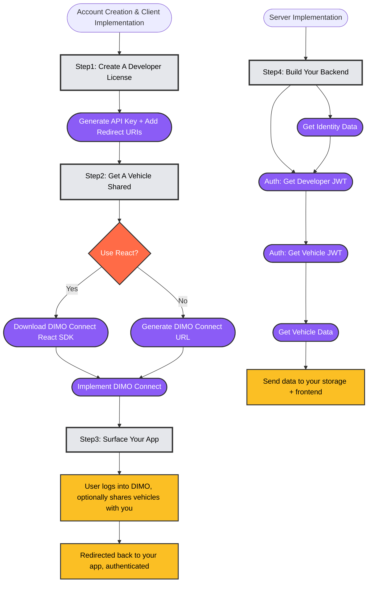

import Stepper, { Step } from '@site/src/components/Stepper';
import Tabs from '@theme/Tabs';
import TabItem from '@theme/TabItem';
import DimoUrlBuilder from '@site/src/components/DimoUrlBuilder';

# Building Your First App

## Walkthrough on building your 1st DIMO-integrated app
Here's an over-simplified walkthrough on how to build your 1st DIMO-integrated app. 
We highly recommend building your application based on a **client-server architecture** as it decouples the user interface with your backend that's responsible for retrieving vehicle data.

