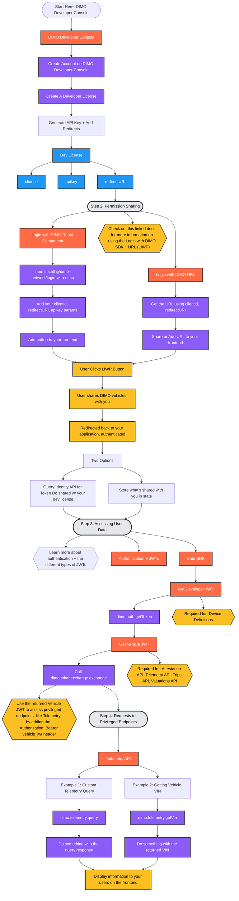

# Developer Journey

```mermaid
flowchart TD
    Start([Start Here: DIMO Developer Console])

    %% Step 1: Setup
    A[DIMO Developer Console]
    B[Create Account on DIMO Developer Console]
    C[Create A Developer License]
    D[Generate API Key + Add Redirects]

    %% Dev License Options
    E[Dev License]
    F[clientid]
    G[apikey]
    H[redirectURI]

    %% Step 2: Permission Sharing
    Step2([Step 2: Permission Sharing])
    I[Login with DIMO React Component]
    J[Login with DIMO URL]
    K{{"Check out this linked docs for more information on using the Login with DIMO SDK + URL (LIWP)"}}

    %% Left Branch
    L[npm install @dimo-network/login-with-dimo]
    M[Add your clientid, redirectURI, apikey params]
    N[Add button to your frontend]

    %% Right Branch
    O[Get the URL using clientid, redirectURI]
    P[Share or Add URL to your frontend]

    %% User Actions
    Q[User Clicks LIWP Button]
    R[User shares DIMO vehicles with you]
    S[Redirected back to your application, authenticated]

    %% Two Options
    T[Two Options]
    U[Query Identity API for Token Do shared w/ your dev license]
    V[Store what's shared with you in state]

    %% Step 3: Accessing User Data
    Step3([Step 3: Accessing User Data])
    W{{"Learn more about authentication + the different types of JWTs"}}
    X[Authentication + JWTs]
    Y[Data SDK]
    Z[Get Developer JWT]
    AA[dimo.auth.getToken]
    BB[Get Vehicle JWT]
    CC[Call dimo.tokenexchange.exchange]

    %% Required Info
    DD{{"Required for: Device Definitions"}}
    EE{{"Required for: Attestation API, Telemetry API, Trips API, Valuations API"}}
    FF{{"Use the returned Vehicle JWT to access privileged endpoints, like Telemetry, by adding the: Authorization: Bearer vehicle_jwt header"}}

    %% Step 4: Requests to Privileged Endpoints
    Step4([Step 4: Requests to Privileged Endpoints])
    GG[Telemetry API]

    %% Examples
    HH[Example 1: Custom Telemetry Query]
    II[Example 2: Getting Vehicle VIN]
    JJ[dimo.telemetry.query]
    KK[dimo.telemetry.getVin]
    LL[Do something with the query response]
    MM[Do something with the returned VIN]

    %% Final Step
    NN[Display information to your users on the frontend]

    %% Connections
    Start --> A
    A --> B
    B --> C
    C --> D
    D --> E
    E --> F
    E --> G
    E --> H

    H --> Step2
    Step2 --> I
    Step2 --> J
    Step2 --> K

    I --> L
    L --> M
    M --> N

    J --> O
    O --> P

    N --> Q
    P --> Q
    Q --> R
    R --> S
    S --> T
    T --> U
    T --> V

    U --> Step3
    V --> Step3
    Step3 --> W
    Step3 --> X
    Step3 --> Y
    Y --> Z
    Z --> DD
    Z --> AA
    AA --> BB
    BB --> EE
    BB --> CC
    CC --> FF

    CC --> Step4
    Step4 --> GG
    GG --> HH
    GG --> II
    HH --> JJ
    II --> KK
    JJ --> LL
    KK --> MM

    LL --> NN
    MM --> NN

    %% Styling
    classDef redBox fill:#ff6b47,stroke:#333,stroke-width:2px,color:#fff
    classDef blueBox fill:#2196f3,stroke:#333,stroke-width:2px,color:#fff
    classDef purpleBox fill:#8b5cf6,stroke:#333,stroke-width:2px,color:#fff
    classDef yellowBox fill:#fbbf24,stroke:#333,stroke-width:2px,color:#000
    classDef stepBox fill:#e5e7eb,stroke:#333,stroke-width:3px,color:#000

    class A,I,J,X,Y,Z,BB,GG redBox
    class E,F,G,H blueBox
    class B,C,L,M,N,O,P,AA,CC,JJ,KK,LL,MM purpleBox
    class K,Q,R,S,NN,DD,EE,FF yellowBox
    class Step2,Step3,Step4 stepBox

```
